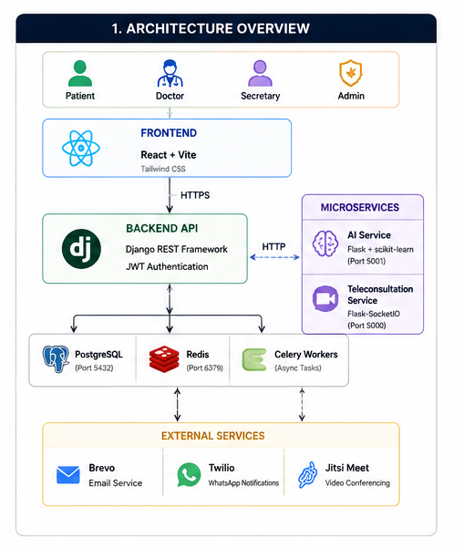
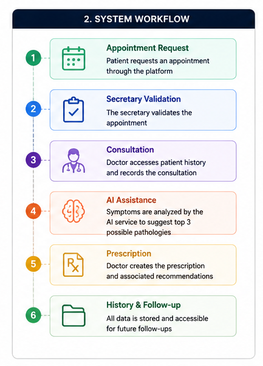
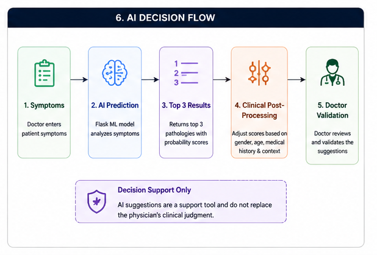
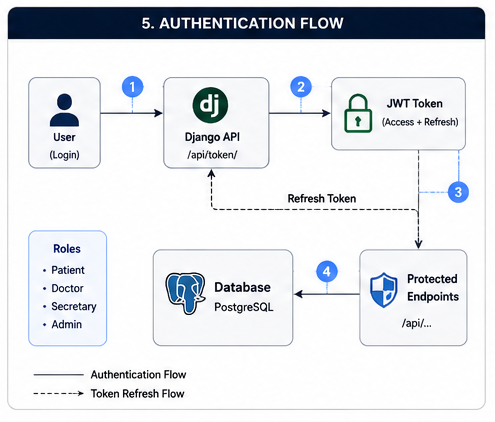

<h1 align="center">🩺 MedPredict</h1>

<p align="center">
AI-Powered Medical Practice Management Platform
<br>
Built with Django, React, Flask and Docker
</p>

<p align="center">


</p>

## 📑 Table of Contents

- [About the Project](#-about-the-project)
- [Key Features](#-key-features)
- [System Architecture](#-system-architecture)
- [System Workflow](#-system-workflow)
- [AI Decision Support](#-ai-decision-support)
- [Technology Stack](#-technology-stack)
- [Installation](#-installation)
- [Authentication & Authorization](#-authentication--authorization)
- [REST API](#-rest-api)
- [Repository Structure](#-repository-structure)
- [Testing](#-testing)
- [Engineering Decisions](#-engineering-decisions)
- [Future Improvements](#-future-improvements)
- [Documentation](#-documentation)

---

# 📖 About the Project

MedPredict is a full-stack medical practice management platform designed to digitalize healthcare workflows by centralizing patient records, appointments, consultations, prescriptions, teleconsultation, and AI-assisted clinical decision support.

The project was developed as an engineering capstone project with the objective of solving real operational challenges encountered in medical practices while applying modern software engineering principles such as modular architecture, microservices, asynchronous processing, secure authentication, and responsible AI integration.

Unlike traditional academic projects, MedPredict was designed as a complete healthcare information system where every technical decision addresses a real business constraint.

---

# ✨ Key Features

## 👨‍⚕️ Medical Practice Management

- Patient management
- Medical history
- Consultation management
- Appointment scheduling
- Digital prescriptions
- Medical records
- Follow-up tracking

---

## 🤖 Artificial Intelligence

- Symptom-based disease prediction
- Top-3 diagnostic suggestions
- Clinical post-processing
- Confidence score visualization
- Decision support for physicians

---

## 🎥 Teleconsultation

- Secure online consultation
- Jitsi Meet integration
- Whisper speech transcription
- Consultation history

---

## 🔔 Smart Notifications

- Email reminders (Brevo)
- WhatsApp notifications (Twilio)
- Appointment confirmations
- Automated reminders

---

## 🔐 Security

- JWT Authentication
- Role-Based Access Control (RBAC)
- Protected REST API
- Secure medical data management

---

# 🏗️ System Architecture

MedPredict follows a modular microservice-oriented architecture.

The platform is divided into several independent services to improve maintainability, scalability, and fault tolerance.

One of the key architectural decisions was separating the AI prediction engine from the core healthcare management system. This ensures that the medical practice remains fully operational even if the AI service becomes unavailable.

<p align="center">
    
</p>

---

## 🏛️ Architecture Components

### 🎨 Frontend

- React
- Vite
- Tailwind CSS
- Zustand

---

### ⚙️ Backend

- Django
- Django REST Framework
- JWT Authentication
- REST API
- Modular Django Apps

---

### 🧠 AI Microservice

- Flask
- Scikit-learn
- Random Forest
- Clinical post-processing

---

### 🎥 Teleconsultation Service

- Flask
- Flask-SocketIO
- Jitsi Meet
- Whisper

---

### ⚡ Background Processing

- Celery
- Redis
- Scheduled notifications
- Email automation

---

### 💾 Database

- PostgreSQL
- Relational data model
- ACID transactions

---
# 🔄 System Workflow

The following workflow illustrates the complete lifecycle of a patient, from registration to consultation, AI-assisted diagnosis, prescription generation, and follow-up.

<p align="center">
    
</p>

The workflow has been designed to reduce administrative tasks while ensuring traceability throughout the patient's journey.

---


# 🤖 AI Decision Support

Artificial Intelligence is integrated as a **decision-support tool**, not as a replacement for physicians.

The AI engine analyzes patient symptoms and predicts the most probable pathologies using a trained Machine Learning model.

After prediction, a clinical post-processing layer adjusts the results according to patient-specific information such as medical history and gender.

Each prediction is presented as a recommendation only.

> **AI is designed to assist physicians, never to replace clinical judgment.**

<p align="center">
    
</p>

### AI Features

- Disease prediction from symptoms
- Top-3 ranked predictions
- Confidence score calculation
- Clinical post-processing
- Explainable recommendations
- Responsible AI integration

---

# 🚀 Technology Stack

| Layer | Technologies |
|--------|--------------|
| Frontend | React • Vite • Tailwind CSS • Zustand |
| Backend | Django • Django REST Framework |
| Database | PostgreSQL |
| AI | Flask • Scikit-learn • Random Forest |
| Authentication | JWT (SimpleJWT) |
| Teleconsultation | Flask-SocketIO • Jitsi Meet • Whisper |
| Notifications | Brevo • Twilio |
| Background Tasks | Celery • Redis |
| Containerization | Docker • Docker Compose |

---

# ⚙️ Installation

## Prerequisites

Before running MedPredict, make sure you have installed:

- Git
- Docker
- Docker Compose

---

## Clone the Repository

```bash
git clone https://github.com/bennajma-douae/medpredict.git
cd medpredict
```

---

## Configure Environment Variables

Create a `.env` file at the project root.

Example:

```env
SECRET_KEY=your_secret_key

DEBUG=True

DATABASE_NAME=medpredict_db
DATABASE_USER=admin
DATABASE_PASSWORD=password123
DATABASE_HOST=db

BREVO_API_KEY=your_brevo_api_key

TWILIO_ACCOUNT_SID=your_account_sid
TWILIO_AUTH_TOKEN=your_auth_token

EMAIL_HOST_USER=your_email
EMAIL_HOST_PASSWORD=your_password

JITSI_DOMAIN=meet.jit.si
```

> Never commit your `.env` file or any sensitive credentials.

---

## Build and Start the Application

Build and start all services:

```bash
docker-compose up --build
```

Docker Compose automatically launches:

- PostgreSQL Database
- Django Backend
- React Frontend
- Redis
- Celery Worker
- AI Microservice
- Teleconsultation Service

---

## Apply Database Migrations

Once the containers are running:

```bash
docker-compose exec backend python manage.py migrate
```

---

## Create an Administrator Account

```bash
docker-compose exec backend python manage.py createsuperuser
```

---

## Access the Application

| Service | URL |
|----------|-------------------------|
| Frontend | http://localhost:5173 |
| Django Backend | http://localhost:8000 |
| AI Service | http://localhost:5001 |
| Teleconsultation | http://localhost:5000 |

---

## Stop the Application

```bash
docker-compose down
```

To also remove Docker volumes:

```bash
docker-compose down -v
```

---

## Docker Services

| Service | Description |
|----------|-------------|
| frontend | React + Vite user interface |
| backend | Django REST API |
| db | PostgreSQL database |
| redis | Message broker |
| celery | Background task processing |
| teleconsult | Teleconsultation service |
| ia-service | AI prediction microservice |

---
# 🔐 Authentication & Authorization

MedPredict secures access using **JSON Web Tokens (JWT)** combined with **Role-Based Access Control (RBAC)** to ensure that every user interacts only with the resources permitted by their role.

<p align="center">
    
</p>

## User Roles

| Role | Permissions |
|------|-------------|
| **Administrator** | Full platform administration, user management and permissions |
| **Doctor** | Manage patients, consultations, prescriptions, AI diagnosis and teleconsultation |
| **Secretary** | Manage appointments, patient registration and scheduling |

---

# 📡 REST API

The backend exposes a RESTful API built with **Django REST Framework**.

### Main API Modules

- Authentication
- Users
- Patients
- Appointments
- Consultations
- Medical Records
- Prescriptions
- AI Prediction
- Notifications
- Teleconsultation

Example authentication endpoint:

```http
POST /api/auth/login/
```

Example response:

```json
{
    "access": "<JWT_ACCESS_TOKEN>",
    "refresh": "<JWT_REFRESH_TOKEN>"
}
```

---

# 📂 Repository Structure

```text
MedPredict
│
├── backend/
│
├── frontend/
│
├── ia-service/
│
├── teleconsult/
│
├── docs/
│   └── diagrams/
│       ├── architecture-overview.png
│       ├── system-workflow.png
│       ├── class-diagram.png
│       ├── authentication-flow.png
│       └── ai-decision-flow.png
│
├── docker-compose.yml
├── README.md
└── .gitignore
```

---

# 🧪 Testing

The project includes automated testing to validate critical functionalities across the different services.

### Backend

- Django Test Framework
- API endpoint testing
- Authentication testing
- Business logic validation

### Frontend

- Component testing
- User interface validation

### AI Service

- Prediction validation
- Model evaluation
- Clinical post-processing verification

---

# 🏗️ Engineering Decisions

Rather than simply implementing features, this project focused on solving real software engineering challenges encountered in healthcare environments.

### Microservice Architecture

The AI engine was intentionally isolated from the Django application.

This architectural choice guarantees that patient management remains fully operational even if the AI service becomes unavailable.

---

### Asynchronous Processing

Celery and Redis handle background tasks such as email notifications and appointment reminders.

This prevents long-running operations from blocking user interactions and improves overall responsiveness.

---

### PostgreSQL

A relational database was selected to ensure data consistency, transactional integrity and reliable management of sensitive medical information.

---

### Docker

Docker Compose provides a reproducible development environment by orchestrating all project services, reducing configuration issues and simplifying deployment.

---

### Responsible AI

The prediction engine is designed to support physicians rather than replace them.

Clinical recommendations remain advisory, while the final diagnosis always belongs to the healthcare professional.

---

# 🚀 Future Improvements

Future enhancements may include:

- CI/CD pipeline
- Cloud deployment
- Mobile application
- OAuth2 authentication
- Kubernetes deployment
- Medical imaging support
- AI model retraining pipeline
- Advanced analytics dashboard

---

# 📚 Documentation

Additional documentation includes:

- Software Requirements Specification (SRS)
- UML Diagrams
- Database Design
- System Architecture
- API Documentation
- User Guide

---

# 📄 Disclaimer

This project was developed as an engineering capstone project for educational purposes.

The source code is published for learning and portfolio purposes only.

---

<div align="center">

### ⭐ If you found this project interesting, consider giving it a star!

Built with ❤️ using Django, React, Flask, PostgreSQL and Docker.

</div>
